# OWL-query
利用jena工具查询owl信息
# 基于TCP/IP的网络管理系统本体建模

## 系统模型

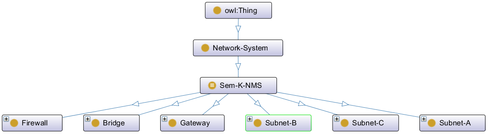

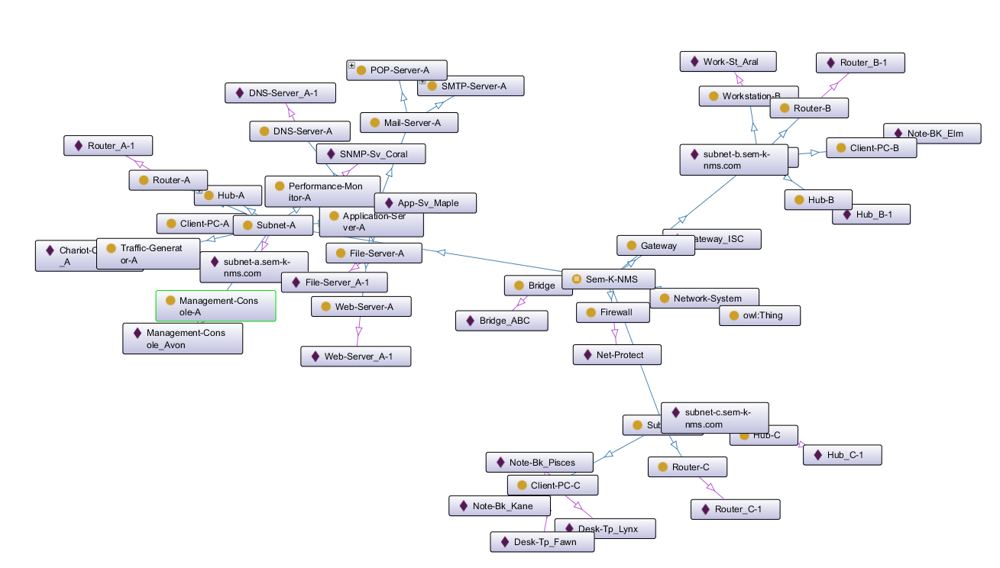

## 代码块

### 命名空间

一个Ontology的标准的初始模块是包含在rdf:RDF标签中的一系列命名空间（namespace）的声明。这些声明用以准确解释文档中的标识符，从而使得Ontology的其他部分具有可读性。

```OWL
<rdf:RDF
    xmlns:rdf="http://www.w3.org/1999/02/22-rdf-syntax-ns#"
    xmlns="http://www.owl-ontologies.com/Ontology1179610702.owl#"
    xmlns:protege="http://protege.stanford.edu/plugins/owl/protege#"
    xmlns:xsp="http://www.owl-ontologies.com/2005/08/07/xsp.owl#"
    xmlns:owl="http://www.w3.org/2002/07/owl#"
    xmlns:xsd="http://www.w3.org/2001/XMLSchema#"
    xmlns:swrl="http://www.w3.org/2003/11/swrl#"
    xmlns:swrlb="http://www.w3.org/2003/11/swrlb#"
    xmlns:rdfs="http://www.w3.org/2000/01/rdf-schema#"
```

### 本体头部

在owl:Ontology标签里给出一组关于本体的声明。这些标签支持一些重要的常务工作比如注释、版本控制以及其他本体的引入等。

```OWL
<owl:Ontology rdf:about="">
    <owl:versionInfo xml:lang="en">Version: 2.1 [April-25, 2007]</owl:versionInfo>
    <rdfs:comment xml:lang="en">Description: Domain Ontology for the TCP/IP-based SNMP-managed Communication Network Management System
	Author: Sameera AbarKinoshita-lab@Tohoku-UniversityCreated: February-11, 2007</rdfs:comment>
</owl:Ontology>
```

### 类

网络管理系统中的类：共计20个

1. 网管系统
2. 网管设备、网桥、防火墙、网关、子网
3. 服务器、客户PC设备、控制台、路由器、集线器、工作站、性能监测器、流量生成器
4. DNS服务器，文件服务器，邮件服务器，Web服务器
5. pop服务器，SMTP服务器

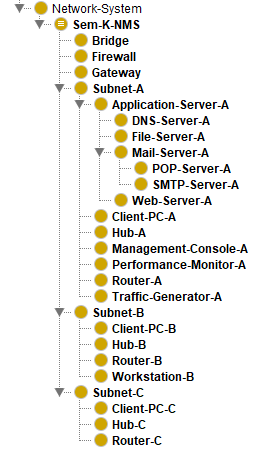

### 从属关系

#### 类从属关系

1. subClassOf：例如子网下属的网元设备，如集线器 、路由器等。
2. disjointWith：不相交类，如集线器与路由器。
3. equivalentClass：如网关管设备与子网或网桥。

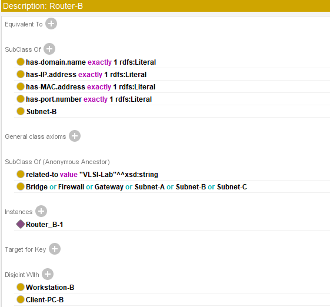

#### 数据类型属性（datatype properties）

定义了IP地址、IP范围、MAC地址、域名和端口号。

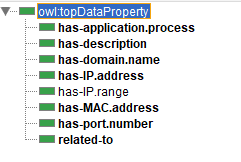

#### 对象属性（object properties）从属关系

inverseOf：一个属性P1被标记为属性P2的逆。如comprises-of与is-part-of，has-node与is-node-of。

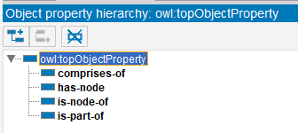

### 实例化对象

instances：实例化对象。具体到各个网元设备，共计27个。

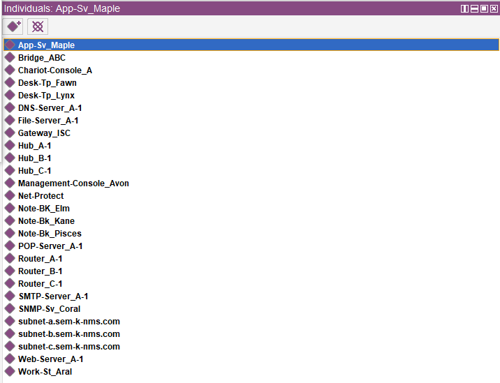

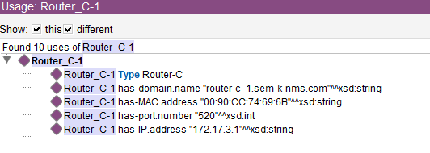

## 基于jena的owl文件的读取与查询(jena3.java)

### 导入必要的包

```java
import java.io.InputStream;
import org.apache.jena.rdf.model.Model;
import org.apache.jena.rdf.model.ModelFactory;
import org.apache.jena.rdf.model.Property;
import org.apache.jena.rdf.model.RDFNode;
import org.apache.jena.rdf.model.Resource;
import org.apache.jena.rdf.model.Statement;
import org.apache.jena.rdf.model.StmtIterator;
import org.apache.jena.riot.RDFDataMgr;
```

### 以owl语言形式读出protege建好的模型

```java
final String inputFileName = "~Uploaded_DomainOntology-NMS.owl";
// create an empty model
OntModel model = ModelFactory.createOntologyModel();
// use the RDFDataMgr to find the input file
InputStream in = RDFDataMgr.open(inputFileName);
if (in == null) {
    throw new IllegalArgumentException(
        "File: " + inputFileName + " not found");
}
// read the RDF/XML file
model.read(in, null);
// write it to standard out
model.write(System.out);
```
结果

```
<owl:Class rdf:ID="Hub-C">
    <owl:disjointWith>
      <owl:Class rdf:ID="Client-PC-C"/>
    </owl:disjointWith>
    <owl:disjointWith>
      <owl:Class rdf:ID="Router-C"/>
    </owl:disjointWith>
    <rdfs:subClassOf>
      <owl:Restriction>
        <owl:onProperty>
          <owl:DatatypeProperty rdf:ID="has-MAC.address"/>
        </owl:onProperty>
        <owl:cardinality rdf:datatype="http://www.w3.org/2001/XMLSchema#int"
        >1</owl:cardinality>
      </owl:Restriction>
    </rdfs:subClassOf>
    <rdfs:subClassOf>
      <owl:Class rdf:ID="Subnet-C"/>
    </rdfs:subClassOf>
    <rdfs:comment rdf:datatype="http://www.w3.org/2001/XMLSchema#string"
    >Network-hub connects multiple network-devices at the physical-layer of the OSI-model.</rdfs:comment>
  </owl:Class>
```

### 查询主体、谓词、客体三元组

```java
// list the statements in the graph
StmtIterator iter = model.listStatements();
// print out the predicate, subject and object of each statement
while (iter.hasNext()) {
    Statement stmt = iter.nextStatement();
    Resource subject = stmt.getSubject(); // get the subject
    Property predicate = stmt.getPredicate(); // get the predicate
    RDFNode object = stmt.getObject(); // get the object
    System.out.print(subject.toString());
    System.out.print(" " + predicate.toString() + " ");
    if (object instanceof Resource) {
        System.out.print(object.toString());
    } else {
        // object is a literal
        System.out.print(" \"" + object.toString() + "\"");
    }
    System.out.println(" .");
}
```

结果

```
http://www.owl-ontologies.com/Ontology1179610702.owl#has-MAC.address  "00:14:22:96:18:13" .
http://www.owl-ontologies.com/Ontology1179610702.owl#has-domain.name  "note-bk_Kane.subnet-c.sem-k-nms.com" .
http://www.owl-ontologies.com/Ontology1179610702.owl#has-IP.address  "172.17.3.4" .
```

### 查询类与子类

```java
for (Iterator i = model.listClasses(); i.hasNext(); ) {
    OntClass c = (OntClass) i.next();
    System.out.print( c.getLocalName() + " " );
}
System.out.print("\n");
OntClass SubnetB = model.getOntClass("http://www.owl-ontologies.com/Ontology1179610702.owl#Subnet-B");
for (Iterator i = SubnetB.listSubClasses(); i.hasNext(); ) {
OntClass c = (OntClass) i.next();
System.out.print( c.getLocalName() + " " );
}
```

结果

```
Client-PC-B Hub-B Workstation-B Mail-Server-A Subnet-B Subnet-A DNS-Server-A Sem-K-NMS Bridge Router-A Management-Console-A Gateway File-Server-A Web-Server-A Firewall Router-C POP-Server-A Application-Server-A Network-System SMTP-Server-A Traffic-Generator-A Router-B null Hub-C Client-PC-C Subnet-C Performance-Monitor-A Hub-A Client-PC-A
Router-B Client-PC-B Hub-B Workstation-B
```

## 利用SPARQL语言查询owl的信息

Fuseki，通过HTTP提供RDF数据。Fuseki是一个SPARQL服务器。它通过HTTP提供使用SPARQL协议的REST式SPARQL HTTP更新，SPARQL查询和SPARQL更新。本部分利用Jena Fuseki 查询owl文件中的信息。

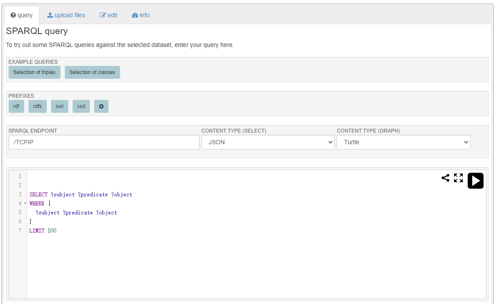

### 查询主语谓词客体三元组

```SPARQL
SELECT ?subject ?predicate ?object
WHERE {
  ?subject ?predicate ?object
}
LIMIT 100
```

结果

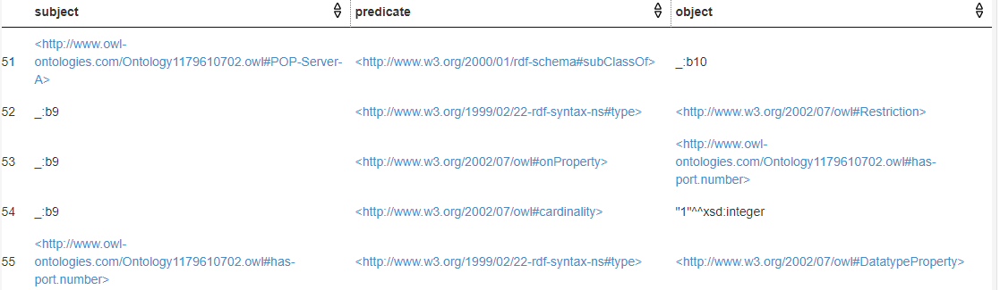

### 查询路由器属性

```SPARQL
SELECT ?p ?o 
WHERE 
{ 
  <http://www.owl-ontologies.com/Ontology1179610702.owl#Router_A-1> ?p ?o 
}
```

```SPARQLs
DESCRIBE <http://www.owl-ontologies.com/Ontology1179610702.owl#Router_A-1>
```

结果

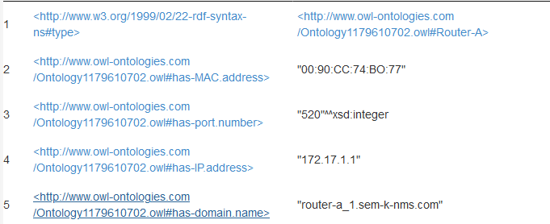

```
:Router_A-1  a            :Router-A ;
        :has-IP.address   "172.17.1.1" ;
        :has-MAC.address  "00:90:CC:74:BO:77" ;
        :has-domain.name  "router-a_1.sem-k-nms.com" ;
        :has-port.number  520 .
```

### 查询所有子类

```SPARQL
SELECT ?x ?fname
WHERE {?x  <http://www.w3.org/2000/01/rdf-schema#subClassOf>  ?fname}
```

结果


